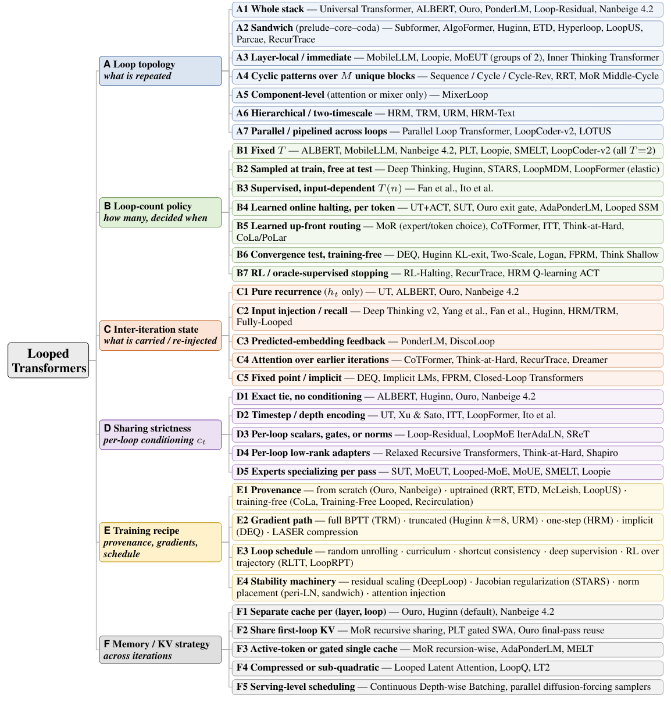

<div align="center">

# Looped Transformers: A Survey of Recurrent-Depth Architectures for Language Models

</div>

## Contents
- [Taxonomy](#taxonomy)
- [A. Loop Topology](#a-loop-topology)
  - [A1. Whole Stack](#a1-whole-stack)
  - [A2. Sandwich](#a2-sandwich-prelude--shared-core--coda)
  - [A3. Layer-Local / Immediate](#a3-layer-local--immediate)
  - [A4. Cyclic Patterns](#a4-cyclic-patterns-over-m-unique-blocks)
  - [A5. Component-Level](#a5-component-level)
  - [A6. Hierarchical / Two-Timescale](#a6-hierarchical--two-timescale)
  - [A7. Parallel / Pipelined](#a7-parallel--pipelined-across-loops)
- [B. Loop-Count Policy](#b-loop-count-policy)
- [C. Inter-Iteration State](#c-inter-iteration-state)
- [D. Sharing Strictness](#d-sharing-strictness)
- [E. Training Recipe](#e-training-recipe)
- [F. Memory / KV Strategy](#f-memory--kv-strategy)

---
# Taxonomy
<p align="center">
  <a href="assets/taxonomy.png"></a>
</p>

# A. Loop Topology

## A1. Whole Stack

The whole transformer stack/shared block is repeatedly applied.

- **[Universal Transformers](https://arxiv.org/abs/1807.03819)** — Mostafa Dehghani, Stephan Gouws, Oriol Vinyals, Jakob Uszkoreit, Łukasz Kaiser. *ICLR 2019.*
- **[ALBERT: A Lite BERT for Self-Supervised Learning of Language Representations](https://arxiv.org/abs/1909.11942)** — Zhenzhong Lan, Mingda Chen, Sebastian Goodman, Kevin Gimpel, Piyush Sharma, Radu Soricut. *ICLR 2020.*
- **[End-to-End Algorithm Synthesis with Recurrent Networks: Logical Extrapolation without Overthinking](https://arxiv.org/abs/2202.05826)** — Arpit Bansal et al. *arXiv, 2022.*
- **[Sparse Universal Transformer](https://aclanthology.org/2023.emnlp-main.12/)** — Shawn Tan, Yikang Shen, Zhenfang Chen, Aaron Courville, Chuang Gan. *EMNLP 2023.*
- **[Looped Transformers Are Better at Learning Learning Algorithms](https://arxiv.org/abs/2311.12424)** — Liu Yang, Kangwook Lee, Robert D. Nowak, Dimitris Papailiopoulos. *ICLR 2024.*
- **[Loop Neural Networks for Parameter Sharing](https://arxiv.org/abs/2409.14199)** — Kei-Sing Ng, Qingchen Wang. *arXiv, 2024.*
- **[PonderLM: Pretraining Language Models to Ponder in Continuous Space](https://arxiv.org/abs/2505.20674)** — Boyi Zeng et al. *ICLR 2026.*
- **[Scaling Latent Reasoning via Looped Language Models](https://arxiv.org/abs/2510.25741)** — Rui-Jie Zhu et al. *arXiv, 2025.*
- **[LoopFormer: Elastic-Depth Looped Transformers for Latent Reasoning via Shortcut Modulation](https://arxiv.org/abs/2602.11451)** — Ahmadreza Jeddi, Marco Ciccone, Babak Taati. *arXiv, 2026.*
- **[AdaPonderLM: Gated Pondering Language Models with Token-Wise Adaptive Depth](https://arxiv.org/abs/2603.01914)** — Shixiang Song et al. *arXiv, 2026.*
- **[Memory-Efficient Looped Transformer: Decoupling Compute from Memory in Looped Language Models](https://arxiv.org/abs/2605.07721)** — Victor Conchello Vendrell et al. *arXiv, 2026.*
- **[Fixed-Point Reasoners: Stable and Adaptive Deep Looped Transformers](https://arxiv.org/abs/2606.18206)** — Sajad Movahedi et al. *arXiv, 2026.*
- **[Nanbeige4.2-3B: Unlocking Agentic Capabilities in a Compact Model](https://arxiv.org/abs/2607.22083)** — Nanbeige Lab et al. *arXiv, 2026.*
- **[Looped State-Space Language Models with Adaptive Exit-State Selection](https://arxiv.org/abs/2607.10110)** — Zhenxuan Yu, Takeshi Kojima, Yutaka Matsuo, Yusuke Iwasawa. *arXiv, 2026.*

## A2. Sandwich: Prelude → Shared Core → Coda

Only the middle recurrent core is shared/looped.

- **[Subformer: Exploring Weight Sharing for Parameter Efficiency in Generative Transformers](https://aclanthology.org/2021.findings-emnlp.344/)** — Machel Reid, Edison Marrese-Taylor, Yutaka Matsuo. *Findings of EMNLP 2021.*
- **[AlgoFormer: An Efficient Transformer Framework with Algorithmic Structures](https://arxiv.org/abs/2402.13572)** — Yihang Gao et al. *arXiv, 2024.*
- **[Scaling up Test-Time Compute with Latent Reasoning: A Recurrent Depth Approach](https://proceedings.neurips.cc/paper_files/paper/2025/hash/3b01972cf31e6fa0fe29e4b8b5c2a0a1-Abstract-Conference.html)** — Jonas Geiping et al. *NeurIPS 2025.*
- **[Encode, Think, Decode: Scaling Test-Time Reasoning with Recursive Latent Thoughts](https://arxiv.org/abs/2510.07358)** — Yeskendir Koishekenov, Aldo Lipani, Nicola Cancedda. *arXiv, 2025.*
- **[Teaching Pretrained Language Models to Think Deeper with Retrofitted Recurrence](https://arxiv.org/abs/2511.07384)** — Sean McLeish et al. *arXiv, 2025.*
- **[Parcae: Scaling Laws for Stable Looped Language Models](https://arxiv.org/abs/2604.12946)** — Hayden Prairie et al. *arXiv, 2026.*
- **[Hyperloop Transformers](https://arxiv.org/abs/2604.21254)** — Abbas Zeitoun, Lucas Torroba-Hennigen, Yoon Kim. *arXiv, 2026.*
- **[Sparse Layers Are Critical to Scaling Looped Language Models](https://arxiv.org/abs/2605.09165)** — Ryan Lee, Jacob Biloki, Edward J. Hu, Jonathan May. *arXiv, 2026.*
- **[LoopUS: Recasting Pretrained LLMs into Looped Latent Refinement Models](https://arxiv.org/abs/2605.11011)** — Taekhyun Park, Yongjae Lee, Dohee Kim, Hyerim Bae. *arXiv, 2026.*
- **[Training-Free Looped Transformers](https://arxiv.org/abs/2605.23872)** — Lizhang Chen, Jonathan Li, Chen Liang, Ni Lao, Qiang Liu. *arXiv, 2026.*
- **[LoopMoE: Unifying Iterative Computation with Mixture-of-Experts for Language Modeling](https://arxiv.org/abs/2606.04438)** — Wenkai Chen et al. *arXiv, 2026.*
- **[SMELT: Scaling Laws for Compute-Matched MoE Looped Transformers](https://arxiv.org/abs/2609.01343)** — Shaowen Wang et al. *arXiv, 2026.*
- **[RecurTrace: Adaptive Latent Reasoning with Loop-Time Memory](https://arxiv.org/abs/2609.03379)** — Yuxiang Wang et al. *arXiv, 2026.*

## A3. Layer-Local / Immediate

Each layer or small layer group is immediately repeated.

- **[MobileLLM: Optimizing Sub-Billion Parameter Language Models for On-Device Use Cases](https://proceedings.mlr.press/v235/liu24ce.html)** — Zechun Liu et al. *ICML 2024.*
- **[MoEUT: Mixture-of-Experts Universal Transformers](https://proceedings.neurips.cc/paper_files/paper/2024/hash/321387ba926b8e58d3591c0aeb52ffc2-Abstract-Conference.html)** — Róbert Csordás, Kazuki Irie, Jürgen Schmidhuber, Christopher Potts, Christopher D. Manning. *NeurIPS 2024.*
- **[Inner Thinking Transformer: Leveraging Dynamic Depth Scaling to Foster Adaptive Internal Thinking](https://aclanthology.org/2025.acl-long.1369/)** — Yilong Chen et al. *ACL 2025.*
- **[Loop the Loopies!](https://arxiv.org/abs/2607.16051)** — Zitian Gao et al. *arXiv, 2026.*

## A4. Cyclic Patterns over M Unique Blocks

A set of unique blocks is reused following sequence/cycle patterns.

- **[Lessons on Parameter Sharing across Layers in Transformers](https://aclanthology.org/2023.sustainlp-1.5/)** — Sho Takase, Shun Kiyono. *SustaiNLP @ ACL 2023.*
- **[Relaxed Recursive Transformers: Effective Parameter Sharing with Layer-Wise LoRA](https://arxiv.org/abs/2410.20672)** — Sangmin Bae, Adam Fisch, Hrayr Harutyunyan, Ziwei Ji, Seungyeon Kim, Tal Schuster. *ICLR 2025.*
- **[Mixture-of-Recursions: Learning Dynamic Recursive Depths for Adaptive Token-Level Computation](https://arxiv.org/abs/2507.10524)** — Sangmin Bae et al. *arXiv, 2025.*

## A5. Component-Level

Only a selected transformer component is recurrent.

- **[Allocating Recurrent Compute in Looped Language Models](https://arxiv.org/abs/2608.18230)** — Ruhai Lin et al. *arXiv, 2026.*  
  - Introduces the **MixerLoop** component-level design used in the survey taxonomy.

## A6. Hierarchical / Two-Timescale

Fast and slow recurrent modules operate at different timescales.

- **[Hierarchical Reasoning Model](https://arxiv.org/abs/2506.21734)** — Guan Wang et al. *arXiv, 2025.*
- **[Less Is More: Recursive Reasoning with Tiny Networks](https://arxiv.org/abs/2510.04871)** — Alexia Jolicoeur-Martineau. *arXiv, 2025.*
- **[Universal Reasoning Model](https://arxiv.org/abs/2512.14693)** — Zitian Gao et al. *arXiv, 2025.*
- **[Hierarchical vs. Flat Iteration in Shared-Weight Transformers](https://arxiv.org/abs/2604.14442)** — Sang-Il Han. *arXiv, 2026.*
- **[HRM-Text: Efficient Pretraining Beyond Scaling](https://arxiv.org/abs/2605.20613)** — Guan Wang et al. *arXiv, 2026.*

## A7. Parallel / Pipelined across Loops

Loop computation is parallelized or pipelined.

- **[Parallel Loop Transformer for Efficient Test-Time Computation Scaling](https://arxiv.org/abs/2510.24824)** — Bohong Wu et al. *arXiv, 2025.*
- **[LoopCoder-v2: Only Loop Once for Efficient Test-Time Computation Scaling](https://arxiv.org/abs/2606.18023)** — Jian Yang et al. *arXiv, 2026.*
- **[Bridging the Gap Between Latent and Explicit Reasoning with Looped Transformers](https://arxiv.org/abs/2606.31779)** — Ying Fan, Anej Svete, Kangwook Lee. *arXiv, 2026.*

---

# B. Loop-Count Policy

## B1. Fixed \(T\)

The model uses a fixed number of recurrent passes.

- **[ALBERT](https://arxiv.org/abs/1909.11942)** — Zhenzhong Lan et al. *ICLR 2020.*
- **[MobileLLM](https://proceedings.mlr.press/v235/liu24ce.html)** — Zechun Liu et al. *ICML 2024.*
- **[PonderLM](https://arxiv.org/abs/2505.20674)** — Boyi Zeng et al. *ICLR 2026.*
- **[Parallel Loop Transformer](https://arxiv.org/abs/2510.24824)** — Bohong Wu et al. *arXiv, 2025.*
- **[Loop the Loopies!](https://arxiv.org/abs/2607.16051)** — Zitian Gao et al. *arXiv, 2026.*
- **[Nanbeige4.2-3B](https://arxiv.org/abs/2607.22083)** — Nanbeige Lab et al. *arXiv, 2026.*
- **[LoopCoder-v2](https://arxiv.org/abs/2606.18023)** — Jian Yang et al. *arXiv, 2026.*
- **[SMELT](https://arxiv.org/abs/2609.01343)** — Shaowen Wang et al. *arXiv, 2026.*

## B2. Sampled at Train, Free at Test

Loop count varies during training and can be changed at inference.

- **[End-to-End Algorithm Synthesis with Recurrent Networks](https://arxiv.org/abs/2202.05826)** — Arpit Bansal et al. *arXiv, 2022.*
- **[Looped Transformers Are Better at Learning Learning Algorithms](https://arxiv.org/abs/2311.12424)** — Liu Yang et al. *ICLR 2024.*
- **[Scaling up Test-Time Compute with Latent Reasoning](https://proceedings.neurips.cc/paper_files/paper/2025/hash/3b01972cf31e6fa0fe29e4b8b5c2a0a1-Abstract-Conference.html)** — Jonas Geiping et al. *NeurIPS 2025.*
- **[Teaching Pretrained Language Models to Think Deeper with Retrofitted Recurrence](https://arxiv.org/abs/2511.07384)** — Sean McLeish et al. *arXiv, 2025.*
- **[LoopFormer](https://arxiv.org/abs/2602.11451)** — Ahmadreza Jeddi et al. *arXiv, 2026.*
- **[Parcae](https://arxiv.org/abs/2604.12946)** — Hayden Prairie et al. *arXiv, 2026.*
- **[Stabilizing Recurrent Dynamics for Test-Time Scalable Latent Reasoning in Looped Language Models](https://arxiv.org/abs/2605.26733)** — Xiao-Wen Yang et al. *arXiv, 2026.*
- **[Looped Diffusion Language Models](https://arxiv.org/abs/2605.26106)** — Sanghyun Lee et al. *arXiv, 2026.*

## B3. Supervised, Input-Dependent \(T(n)\)

Loop count is supervised as a function of the input/problem size.

- **[Looped Transformers for Length Generalization](https://proceedings.iclr.cc/paper_files/paper/2025/hash/25cc3adf8c85f7c70989cb8a97a691a7-Abstract-Conference.html)** — Ying Fan, Yilun Du, Kannan Ramchandran, Kangwook Lee. *ICLR 2025.*
- **[Universal Transformers for Circuit Computations: Perfect Length Generalization in Tiny Transformers](https://arxiv.org/abs/2608.31067)** — Takuya Ito, Ruchir Puri, Murray Campbell, Parikshit Ram. *arXiv, 2026.*

## B4. Learned Online Halting

The stopping decision is made while recurrence is running.

- **[Adaptive Computation Time for Recurrent Neural Networks](https://arxiv.org/abs/1603.08983)** — Alex Graves. *arXiv, 2016.*
- **[Universal Transformers](https://arxiv.org/abs/1807.03819)** — Mostafa Dehghani et al. *ICLR 2019.*
- **[PonderNet: Learning to Ponder](https://arxiv.org/abs/2107.05407)** — Andrea Banino, Jan Balaguer, Charles Blundell. *arXiv, 2021.*
- **[Sparse Universal Transformer](https://aclanthology.org/2023.emnlp-main.12/)** — Shawn Tan et al. *EMNLP 2023.*
- **[Scaling Latent Reasoning via Looped Language Models](https://arxiv.org/abs/2510.25741)** — Rui-Jie Zhu et al. *arXiv, 2025.*
- **[AdaPonderLM](https://arxiv.org/abs/2603.01914)** — Shixiang Song et al. *arXiv, 2026.*
- **[LoopUS](https://arxiv.org/abs/2605.11011)** — Taekhyun Park et al. *arXiv, 2026.*
- **[Looped State-Space Language Models with Adaptive Exit-State Selection](https://arxiv.org/abs/2607.10110)** — Zhenxuan Yu et al. *arXiv, 2026.*

## B5. Learned Up-Front Routing

Depth is allocated before recurrent computation begins.

- **[CoTFormer: A Chain of Thought Driven Architecture with Budget-Adaptive Computation Cost at Inference](https://proceedings.iclr.cc/paper_files/paper/2025/hash/1eaa5146756be028ad6fff1efcc8e6bd-Abstract-Conference.html)** — Amirkeivan Mohtashami, Matteo Pagliardini, Martin Jaggi. *ICLR 2025.*
- **[Inner Thinking Transformer](https://aclanthology.org/2025.acl-long.1369/)** — Yilong Chen et al. *ACL 2025.*
- **[Mixture-of-Recursions](https://arxiv.org/abs/2507.10524)** — Sangmin Bae et al. *arXiv, 2025.*
- **[Skip a Layer or Loop It? Test-Time Depth Adaptation of Pretrained LLMs](https://arxiv.org/abs/2507.07996)** — Ziyue Li, Yang Li, Tianyi Zhou. *arXiv, 2025.*
- **[Think-at-Hard: Selective Latent Iterations to Improve Reasoning Language Models](https://arxiv.org/abs/2511.08577)** — Tianyu Fu et al. *arXiv, 2025.*
- **[Skip a Layer or Loop It? Learning Program-of-Layers in LLMs](https://arxiv.org/abs/2606.06574)** — Ziyue Li, Yang Li, Tianyi Zhou. *arXiv, 2026.*

## B6. Convergence Test / Training-Free Halting

The model stops when hidden states or outputs satisfy a convergence criterion.

- **[Deep Equilibrium Models](https://arxiv.org/abs/1909.01377)** — Shaojie Bai, J. Zico Kolter, Vladlen Koltun. *NeurIPS 2019.*
- **[Scaling up Test-Time Compute with Latent Reasoning](https://proceedings.neurips.cc/paper_files/paper/2025/hash/3b01972cf31e6fa0fe29e4b8b5c2a0a1-Abstract-Conference.html)** — Jonas Geiping et al. *NeurIPS 2025.*
- **[Two-Scale Latent Dynamics for Recurrent-Depth Transformers](https://arxiv.org/abs/2509.23314)** — Francesco Pappone, Donato Crisostomi, Emanuele Rodolà. *arXiv, 2025.*
- **[Fixed-Point Reasoners](https://arxiv.org/abs/2606.18206)** — Sajad Movahedi et al. *arXiv, 2026.*
- **[Per-Token Fixed-Point Convergence in Depth-Recurrent Transformers](https://arxiv.org/abs/2607.14427)** — Joe Logan. *arXiv, 2026.*
- **[Think Shallow, Solve Deep: Controlling Recurrent Dynamics for Reliable Test-Time Depth](https://arxiv.org/abs/2608.18222)** — Ivan Viakhirev et al. *arXiv, 2026.*

## B7. RL / Oracle-Supervised Stopping

Stopping policies are trained with reinforcement learning or oracle supervision.

- **[Hierarchical Reasoning Model](https://arxiv.org/abs/2506.21734)** — Guan Wang et al. *arXiv, 2025.*
- **[Stabilizing Extrapolation in Looped Transformers via Learned Stochastic Stopping](https://arxiv.org/abs/2606.29983)** — Hsun-Yu Kuo et al. *arXiv, 2026.*
- **[RecurTrace: Adaptive Latent Reasoning with Loop-Time Memory](https://arxiv.org/abs/2609.03379)** — Yuxiang Wang et al. *arXiv, 2026.*

---

# C. Inter-Iteration State

## C1. Pure Recurrence

Only the recurrent hidden state is passed forward.

- **[Universal Transformers](https://arxiv.org/abs/1807.03819)** — Mostafa Dehghani et al. *ICLR 2019.*
- **[ALBERT](https://arxiv.org/abs/1909.11942)** — Zhenzhong Lan et al. *ICLR 2020.*
- **[MobileLLM](https://proceedings.mlr.press/v235/liu24ce.html)** — Zechun Liu et al. *ICML 2024.*
- **[MoEUT](https://proceedings.neurips.cc/paper_files/paper/2024/hash/321387ba926b8e58d3591c0aeb52ffc2-Abstract-Conference.html)** — Róbert Csordás et al. *NeurIPS 2024.*
- **[Relaxed Recursive Transformers](https://arxiv.org/abs/2410.20672)** — Sangmin Bae et al. *ICLR 2025.*
- **[Ouro / Scaling Latent Reasoning via Looped Language Models](https://arxiv.org/abs/2510.25741)** — Rui-Jie Zhu et al. *arXiv, 2025.*

## C2. Input Injection / Recall

The original input is re-injected across recurrent steps.

- **[End-to-End Algorithm Synthesis with Recurrent Networks](https://arxiv.org/abs/2202.05826)** — Arpit Bansal et al. *arXiv, 2022.*
- **[Looped Transformers Are Better at Learning Learning Algorithms](https://arxiv.org/abs/2311.12424)** — Liu Yang et al. *ICLR 2024.*
- **[Looped Transformers for Length Generalization](https://proceedings.iclr.cc/paper_files/paper/2025/hash/25cc3adf8c85f7c70989cb8a97a691a7-Abstract-Conference.html)** — Ying Fan et al. *ICLR 2025.*
- **[Scaling up Test-Time Compute with Latent Reasoning](https://proceedings.neurips.cc/paper_files/paper/2025/hash/3b01972cf31e6fa0fe29e4b8b5c2a0a1-Abstract-Conference.html)** — Jonas Geiping et al. *NeurIPS 2025.*
- **[Hierarchical Reasoning Model](https://arxiv.org/abs/2506.21734)** — Guan Wang et al. *arXiv, 2025.*
- **[Less Is More: Recursive Reasoning with Tiny Networks](https://arxiv.org/abs/2510.04871)** — Alexia Jolicoeur-Martineau. *arXiv, 2025.*
- **[Simply Stabilizing the Loop via Fully Looped Transformer](https://arxiv.org/abs/2605.18797)** — Rao Fu et al. *arXiv, 2026.*
- **[Bridging the Gap Between Latent and Explicit Reasoning with Looped Transformers](https://arxiv.org/abs/2606.31779)** — Ying Fan, Anej Svete, Kangwook Lee. *arXiv, 2026.*

## C3. Predicted-Embedding Feedback

A predicted embedding is fed into the next recurrent iteration.

- **[PonderLM: Pretraining Language Models to Ponder in Continuous Space](https://arxiv.org/abs/2505.20674)** — Boyi Zeng et al. *ICLR 2026.*
- **[DiscoLoop: Looping Discrete Embeddings and Continuous Hidden States for Multi-Hop Reasoning](https://arxiv.org/abs/2607.00341)** — Hengyu Fu et al. *arXiv, 2026.*

## C4. Attention over Earlier Iterations

Later recurrent steps directly attend to earlier iterations.

- **[CoTFormer](https://proceedings.iclr.cc/paper_files/paper/2025/hash/1eaa5146756be028ad6fff1efcc8e6bd-Abstract-Conference.html)** — Amirkeivan Mohtashami, Matteo Pagliardini, Martin Jaggi. *ICLR 2025.*
- **[Think-at-Hard](https://arxiv.org/abs/2511.08577)** — Tianyu Fu et al. *arXiv, 2025.*
- **[Depth-Recurrent Attention Mixtures: Giving Latent Reasoning the Attention It Deserves](https://arxiv.org/abs/2601.21582)** — Jonas Knupp et al. *arXiv, 2026.*
- **[RecurTrace](https://arxiv.org/abs/2609.03379)** — Yuxiang Wang et al. *arXiv, 2026.*

## C5. Fixed Point / Implicit

The recurrent computation is defined through an equilibrium/fixed point.

- **[Deep Equilibrium Models](https://arxiv.org/abs/1909.01377)** — Shaojie Bai, J. Zico Kolter, Vladlen Koltun. *NeurIPS 2019.*
- **[Implicit Language Models Are RNNs: Balancing Parallelization and Expressivity](https://arxiv.org/abs/2502.07827)** — Mark Schöne et al. *arXiv, 2025.*
- **[Closed-Loop Transformers: Autoregressive Modeling as Iterative Latent Equilibrium](https://arxiv.org/abs/2511.21882)** — Akbar Anbar Jafari, Gholamreza Anbarjafari. *arXiv, 2025.*
- **[Fixed-Point Reasoners](https://arxiv.org/abs/2606.18206)** — Sajad Movahedi et al. *arXiv, 2026.*

---

# D. Sharing Strictness

## D1. Exact Tie, No Conditioning

The same parameters are reused exactly across recurrent iterations.

- **[ALBERT](https://arxiv.org/abs/1909.11942)** — Zhenzhong Lan et al. *ICLR 2020.*
- **[Scaling up Test-Time Compute with Latent Reasoning](https://proceedings.neurips.cc/paper_files/paper/2025/hash/3b01972cf31e6fa0fe29e4b8b5c2a0a1-Abstract-Conference.html)** — Jonas Geiping et al. *NeurIPS 2025.*
- **[Scaling Latent Reasoning via Looped Language Models](https://arxiv.org/abs/2510.25741)** — Rui-Jie Zhu et al. *arXiv, 2025.*
- **[Nanbeige4.2-3B](https://arxiv.org/abs/2607.22083)** — Nanbeige Lab et al. *arXiv, 2026.*

## D2. Timestep / Depth Encoding

The shared recurrent block is conditioned on the current loop/depth index.

- **[Universal Transformers](https://arxiv.org/abs/1807.03819)** — Mostafa Dehghani et al. *ICLR 2019.*
- **[On Expressive Power of Looped Transformers: Theoretical Analysis and Enhancement via Timestep Encoding](https://arxiv.org/abs/2410.01405)** — Kevin Xu, Issei Sato. *arXiv, 2024.*
- **[Inner Thinking Transformer](https://aclanthology.org/2025.acl-long.1369/)** — Yilong Chen et al. *ACL 2025.*
- **[LoopFormer](https://arxiv.org/abs/2602.11451)** — Ahmadreza Jeddi et al. *arXiv, 2026.*
- **[Universal Transformers for Circuit Computations](https://arxiv.org/abs/2608.31067)** — Takuya Ito et al. *arXiv, 2026.*

## D3. Per-Loop Scalars, Gates, or Norms

Small loop-specific parameters modulate the shared computation.

- **[Loop Neural Networks for Parameter Sharing](https://arxiv.org/abs/2409.14199)** — Kei-Sing Ng, Qingchen Wang. *arXiv, 2024.*
- **[Sliced Recursive Transformer](https://arxiv.org/abs/2111.05297)** — Zhiqiang Shen, Zechun Liu, Eric Xing. *arXiv, 2021.*
- **[LoopMoE: Unifying Iterative Computation with Mixture-of-Experts for Language Modeling](https://arxiv.org/abs/2606.04438)** — Wenkai Chen et al. *arXiv, 2026.*

## D4. Per-Loop Low-Rank Adapters

Iteration-specific low-rank adapters relax exact weight sharing.

- **[Relaxed Recursive Transformers](https://arxiv.org/abs/2410.20672)** — Sangmin Bae et al. *ICLR 2025.*
- **[Think-at-Hard](https://arxiv.org/abs/2511.08577)** — Tianyu Fu et al. *arXiv, 2025.*
- **[Retrofitting Recurrent Depth into a Pretrained Language Model: Installation, Extrapolation, Transfer, and Retention at Two Parameter Budgets](https://arxiv.org/abs/2608.11233)** — Mark Shapiro. *arXiv, 2026.*

## D5. Experts Specializing per Pass

Sparse experts can specialize across recurrent iterations.

- **[Sparse Universal Transformer](https://aclanthology.org/2023.emnlp-main.12/)** — Shawn Tan et al. *EMNLP 2023.*
- **[MoEUT](https://proceedings.neurips.cc/paper_files/paper/2024/hash/321387ba926b8e58d3591c0aeb52ffc2-Abstract-Conference.html)** — Róbert Csordás et al. *NeurIPS 2024.*
- **[Mixture of Universal Experts: Scaling Virtual Width via Depth-Width Transformation](https://arxiv.org/abs/2603.04971)** — Yilong Chen et al. *arXiv, 2026.*
- **[Sparse Layers Are Critical to Scaling Looped Language Models](https://arxiv.org/abs/2605.09165)** — Ryan Lee et al. *arXiv, 2026.*
- **[LoopMoE](https://arxiv.org/abs/2606.04438)** — Wenkai Chen et al. *arXiv, 2026.*
- **[Loop the Loopies!](https://arxiv.org/abs/2607.16051)** — Zitian Gao et al. *arXiv, 2026.*
- **[SMELT](https://arxiv.org/abs/2609.01343)** — Shaowen Wang et al. *arXiv, 2026.*

---

# E. Training Recipe

## E1. Provenance

### From Scratch

- **[Scaling up Test-Time Compute with Latent Reasoning](https://proceedings.neurips.cc/paper_files/paper/2025/hash/3b01972cf31e6fa0fe29e4b8b5c2a0a1-Abstract-Conference.html)** — Jonas Geiping et al. *NeurIPS 2025.*
- **[Scaling Latent Reasoning via Looped Language Models](https://arxiv.org/abs/2510.25741)** — Rui-Jie Zhu et al. *arXiv, 2025.*
- **[Nanbeige4.2-3B](https://arxiv.org/abs/2607.22083)** — Nanbeige Lab et al. *arXiv, 2026.*
- **[Loop the Loopies!](https://arxiv.org/abs/2607.16051)** — Zitian Gao et al. *arXiv, 2026.*
- **[LoopCoder-v2](https://arxiv.org/abs/2606.18023)** — Jian Yang et al. *arXiv, 2026.*

### Uptrained / Retrofitted

- **[Relaxed Recursive Transformers](https://arxiv.org/abs/2410.20672)** — Sangmin Bae et al. *ICLR 2025.*
- **[Encode, Think, Decode](https://arxiv.org/abs/2510.07358)** — Yeskendir Koishekenov et al. *arXiv, 2025.*
- **[Teaching Pretrained Language Models to Think Deeper with Retrofitted Recurrence](https://arxiv.org/abs/2511.07384)** — Sean McLeish et al. *arXiv, 2025.*
- **[Think-at-Hard](https://arxiv.org/abs/2511.08577)** — Tianyu Fu et al. *arXiv, 2025.*
- **[LoopUS](https://arxiv.org/abs/2605.11011)** — Taekhyun Park et al. *arXiv, 2026.*

### Training-Free

- **[Skip a Layer or Loop It? Test-Time Depth Adaptation of Pretrained LLMs](https://arxiv.org/abs/2507.07996)** — Ziyue Li, Yang Li, Tianyi Zhou. *arXiv, 2025.*
- **[Training-Free Looped Transformers](https://arxiv.org/abs/2605.23872)** — Lizhang Chen et al. *arXiv, 2026.*
- **[Recirculation](https://arxiv.org/abs/2608.17981)** — Michael C. Mozer et al. *arXiv, 2026.*

## E2. Gradient Path

### Full BPTT

- **[Less Is More: Recursive Reasoning with Tiny Networks](https://arxiv.org/abs/2510.04871)** — Alexia Jolicoeur-Martineau. *arXiv, 2025.*
- **[Scaling Latent Reasoning via Looped Language Models](https://arxiv.org/abs/2510.25741)** — Rui-Jie Zhu et al. *arXiv, 2025.*

### Truncated BPTT

- **[Scaling up Test-Time Compute with Latent Reasoning](https://proceedings.neurips.cc/paper_files/paper/2025/hash/3b01972cf31e6fa0fe29e4b8b5c2a0a1-Abstract-Conference.html)** — Jonas Geiping et al. *NeurIPS 2025.*
- **[Universal Reasoning Model](https://arxiv.org/abs/2512.14693)** — Zitian Gao et al. *arXiv, 2025.*

### One-Step Approximation

- **[Hierarchical Reasoning Model](https://arxiv.org/abs/2506.21734)** — Guan Wang et al. *arXiv, 2025.*

### Implicit Differentiation

- **[Deep Equilibrium Models](https://arxiv.org/abs/1909.01377)** — Shaojie Bai, J. Zico Kolter, Vladlen Koltun. *NeurIPS 2019.*

### Activation-Compressed BPTT

- **[LASER: Low-Rank Activation SVD for Efficient Recursion](https://arxiv.org/abs/2604.17224)** — Ege Çakar, Ketan Raghu, Lia Zheng. *arXiv, 2026.*

## E3. Loop Schedule

### Random Unrolling / Curriculum

- **[End-to-End Algorithm Synthesis with Recurrent Networks](https://arxiv.org/abs/2202.05826)** — Arpit Bansal et al. *arXiv, 2022.*
- **[Looped Transformers Are Better at Learning Learning Algorithms](https://arxiv.org/abs/2311.12424)** — Liu Yang et al. *ICLR 2024.*
- **[Teaching Pretrained Language Models to Think Deeper with Retrofitted Recurrence](https://arxiv.org/abs/2511.07384)** — Sean McLeish et al. *arXiv, 2025.*

### Shortcut Consistency

- **[LoopFormer](https://arxiv.org/abs/2602.11451)** — Ahmadreza Jeddi et al. *arXiv, 2026.*

### Deep Supervision

- **[HRM-Text: Efficient Pretraining Beyond Scaling](https://arxiv.org/abs/2605.20613)** — Guan Wang et al. *arXiv, 2026.*

### RL over the Latent Trajectory

- **[Prioritize the Process, Not Just the Outcome: Rewarding Latent Thought Trajectories Improves Reasoning in Looped Language Models](https://arxiv.org/abs/2602.10520)** — Jonathan Williams, Esin Tureci. *arXiv, 2026.*
- **[LoopRPT: Reinforcement Pretraining for Looped Language Models](https://arxiv.org/abs/2603.19714)** — Guo Tang et al. *arXiv, 2026.*

## E4. Stability Machinery

- **[On the Residual Scaling of Looped Transformers: Stability and Transferability](https://arxiv.org/abs/2606.18524)** — Shaowen Wang et al. *arXiv, 2026.*
- **[DeepLoop: Depth Scaling for Looped Transformers](https://arxiv.org/abs/2607.13491)** — Shuzhen Li, Yifan Zhang, Jiacheng Guo, Quanquan Gu, Mengdi Wang. *arXiv, 2026.*
- **[Stabilizing Recurrent Dynamics for Test-Time Scalable Latent Reasoning in Looped Language Models](https://arxiv.org/abs/2605.26733)** — Xiao-Wen Yang et al. *arXiv, 2026.*
- **[Simply Stabilizing the Loop via Fully Looped Transformer](https://arxiv.org/abs/2605.18797)** — Rao Fu et al. *arXiv, 2026.*
- **[Stability and Generalization in Looped Transformers](https://arxiv.org/abs/2604.15259)** — Asher Labovich. *arXiv, 2026.*

---

# F. Memory / KV Strategy

## F1. Separate Cache per (Layer, Loop)

A separate KV cache is retained for every loop.

- **[Scaling up Test-Time Compute with Latent Reasoning](https://proceedings.neurips.cc/paper_files/paper/2025/hash/3b01972cf31e6fa0fe29e4b8b5c2a0a1-Abstract-Conference.html)** — Jonas Geiping et al. *NeurIPS 2025.*
- **[Scaling Latent Reasoning via Looped Language Models](https://arxiv.org/abs/2510.25741)** — Rui-Jie Zhu et al. *arXiv, 2025.*
- **[Nanbeige4.2-3B](https://arxiv.org/abs/2607.22083)** — Nanbeige Lab et al. *arXiv, 2026.*

## F2. Share First-Loop KV

KV states from the first recurrence are reused.

- **[Mixture-of-Recursions](https://arxiv.org/abs/2507.10524)** — Sangmin Bae et al. *arXiv, 2025.*
- **[Parallel Loop Transformer](https://arxiv.org/abs/2510.24824)** — Bohong Wu et al. *arXiv, 2025.*
- **[Scaling Latent Reasoning via Looped Language Models](https://arxiv.org/abs/2510.25741)** — Rui-Jie Zhu et al. *arXiv, 2025.*

## F3. Active-Token / Gated Single Cache

Only active token states are stored or one cache is updated with a gate.

- **[Mixture-of-Recursions](https://arxiv.org/abs/2507.10524)** — Sangmin Bae et al. *arXiv, 2025.*
- **[AdaPonderLM](https://arxiv.org/abs/2603.01914)** — Shixiang Song et al. *arXiv, 2026.*
- **[Memory-Efficient Looped Transformer](https://arxiv.org/abs/2605.07721)** — Victor Conchello Vendrell et al. *arXiv, 2026.*

## F4. Compressed or Sub-Quadratic

The recurrent KV/attention representation is compressed or replaced by a more memory-efficient mechanism.

- **[Looped Latent Attention: Cross-Loop KV Compression for Looped Transformers](https://arxiv.org/abs/2607.15456)** — James O'Neill, Fergal Reid. *arXiv, 2026.*
- **[LoopQ: Quantization for Recursive Transformers](https://arxiv.org/abs/2605.16343)** — Rui Fang, Hsi-Wen Chen, Ming-Syan Chen. *arXiv, 2026.*
- **[LT²: Linear-Time Looped Transformers](https://arxiv.org/abs/2605.20670)** — Chunyuan Deng et al. *arXiv, 2026.*
- **[Allocating Recurrent Compute in Looped Language Models](https://arxiv.org/abs/2608.18230)** — Ruhai Lin et al. *arXiv, 2026.*

## F5. Serving-Level Scheduling

The optimization is implemented at the inference/serving scheduler level.

- **[Relaxed Recursive Transformers: Effective Parameter Sharing with Layer-Wise LoRA](https://arxiv.org/abs/2410.20672)** — Sangmin Bae et al. *ICLR 2025.*
- **[Efficient Parallel Samplers for Recurrent-Depth Models and Their Connection to Diffusion Language Models](https://arxiv.org/abs/2510.14961)** — Jonas Geiping, Xinyu Yang, Guinan Su. *arXiv, 2025.*
- **[Depth-Adaptive Inference of Looped Language Models via Continuous Depth Batching](https://arxiv.org/abs/2608.09444)** — Kristian Schwethelm, Daniel Rueckert, Georgios Kaissis. *arXiv, 2026.*

---

## Contributing

Contributions are welcome. Please keep new entries consistent with the format:

```markdown
- **[Paper Title](paper-link)** — Author 1, Author 2, et al. *Venue, Year.*
```